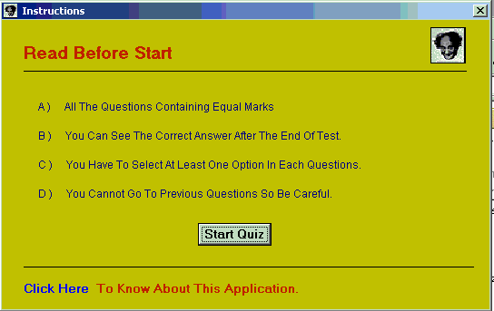



## Three Tier Application

### Description

This is Quiz application and a perfect example of (3 tier application (VB-COM-ACCESS)).plus you will find TUTORIAL OF 3 TYRE APPLICATION,plus sorce of COM dll.Those who wnat to know about of 3 tier application must read this and remember please vote me . e mail : deepakmailto@rediffmail.com
 
### More Info
 

             |
---                |---
**Submitted On**   |2002-06-05 19:46:40
**By**             |[Deepak Sharma](https://github.com/Planet-Source-Code/PSCIndex/blob/master/ByAuthor/deepak-sharma.md)
**Level**          |Advanced
**User Rating**    |5.0 (15 globes from 3 users)
**Compatibility**  |VB 6\.0
**Category**       |[OLE/ COM/ DCOM/ Active\-X](https://github.com/Planet-Source-Code/PSCIndex/blob/master/ByCategory/ole-com-dcom-active-x__1-29.md)
**World**          |[Visual Basic](https://github.com/Planet-Source-Code/PSCIndex/blob/master/ByWorld/visual-basic.md)
**Archive File**   |[Three\_Tier90964662002\.zip](https://github.com/Planet-Source-Code/deepak-sharma-three-tier-application__1-35535/archive/master.zip)

